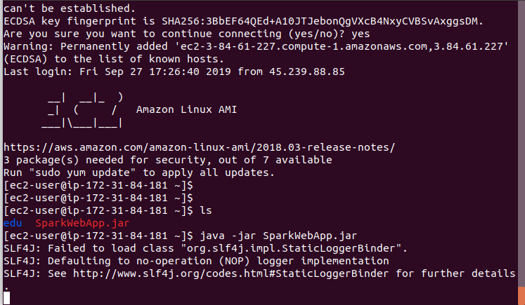

# AWS GATEWAY AND LAMBDA FUNCTIONS
usage of amazon AWS GATEWAY and LAMBDA FUNCTIONS 

## Getting Started
Follow the next instructions to run an deploy the project 
### Prerequisites

 - Maven 3.6. If you don't have it, follow this tutorial according to your OS. [How to install maven](https://maven.apache.org/install.html)
 - JDK (Java Development Kit) 1.8. If you don't have it, go to this tutorial. [Java SE Development Kit 8](https://www.oracle.com/java/technologies/jdk8-downloads.html)
 - Git bash. If you don't have it, go here [GIT](https://git-scm.com/) and follow this basic turorial. [GIT DOCS](https://git-scm.com/docs)

### Installation and Local Deployment
Clone the project:

    git clone https://github.com/darm145/AWSgateway-lambda

use cd to navigate through the folders and access the project

    cd AWSgateway-lambda

Run it

    mvn package
    mvn exec:java -D exec.mainClass="edu.escuelaing.arep.SparkWebApp"
    

### Demostration

after implementing everything on the cloud we proceed to modify the spark web app to obtain the resources located on AWS.  
  
later on we proceed to connect to the EC2 machine and deploy the server.  
  
and we try to access the webpage via a browser.  
  
finally we test the application and check everything is correct.  
  
  

	
    

## Built with
[Maven](https://maven.apache.org/) - Dependency Management

## Author
David Daniel A. Ramirez Moreno- [GitHub](https://github.com/darm145) - Escuela Colombiana de Ingeniería Julio Garavito

## License
This project is under GNU General Public License - see  [LICENSE](https://github.com/darm145/AWSgateway-lambda/blob/master/LICENSE) to more info.
